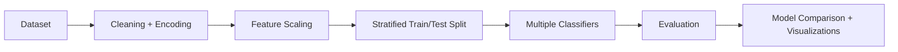

# Disease Prediction Toolkit 🧠

A modular **classical machine-learning workflow** for experimenting with disease-risk classification using a heart-disease dataset. The project separates preprocessing, model training, evaluation, visualization, and tests.

> **Disclaimer:** This is an educational ML project and is **not a medical diagnostic tool**.

## 🏗️ ML Pipeline



## ✨ What It Demonstrates

- Exploratory data analysis
- Missing-value handling
- Categorical feature encoding
- Feature standardization
- Stratified train/test splitting
- Multiple classification algorithms
- Random Forest hyperparameter tuning with `GridSearchCV`
- Accuracy, Precision, Recall and F1 evaluation
- ROC-AUC analysis
- Confusion matrices and visualization
- Automated tests for core ML components

## 🤖 Models

| Model | Purpose |
|---|---|
| Logistic Regression | Interpretable baseline |
| Decision Tree | Rule-based classification |
| Random Forest | Ensemble baseline |
| Gradient Boosting | Boosted ensemble model |
| SVM | Margin-based classifier |
| Optimized Random Forest | Hyperparameter-tuned model |

## 📊 Evaluation

The toolkit evaluates models using:

- Accuracy
- Precision
- Recall
- F1-Score
- ROC-AUC
- Confusion Matrix

## 📁 Structure

```text
Disease-Prediction-Toolkit/
├── Project.ipynb
├── heart.csv
├── src/
│   ├── preprocessing.py
│   ├── models.py
│   ├── evaluation.py
│   └── visualization.py
├── Requirements
├── Test File
└── README.md
```

## ⚙️ Setup

```bash
git clone https://github.com/deadlyrps2802/disease-prediction-toolkit.git
cd disease-prediction-toolkit
pip install -r Requirements
```

Run the notebook with Jupyter/JupyterLab:

```bash
jupyter notebook Project.ipynb
```

Run tests:

```bash
pytest
```

## 🔁 Reproducibility Flow

```text
Raw dataset
    ↓
Preprocessing
    ↓
Train/Test split
    ↓
Model training
    ↓
Evaluation
    ↓
Saved experiments / visualizations
```

## 🚀 Future Improvements

- Reproducible training CLI
- `sklearn.Pipeline` based preprocessing
- Cross-validation and experiment tracking
- Lightweight inference API
- CI pipeline for automated testing

## Author

**Rudra Pratap Singh** — B.Tech CSE (AI)

GitHub: [@deadlyrps2802](https://github.com/deadlyrps2802)
